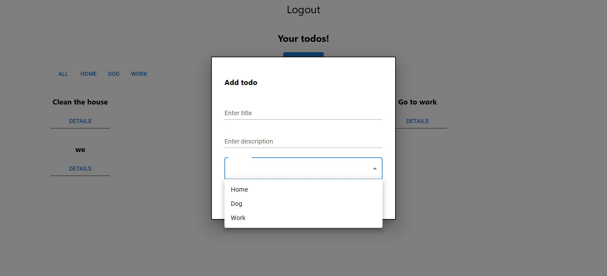

Simple Django REST API. The frontend is React and it is provided by SoftUni.

The app has two models - Todos and categories.
To create tasks the user must register and log in

When logged in the user can see his Todos:

A logged in user can add new Todos:

